<table>
<tr>
<td valign="top"></td>
<td valign="top"></td>
</tr>
</table>

## Pranav Mahajan

**Computer Engineering Student · Full-Stack Developer · AI Enthusiast**

 
pranavmahajan492@gmail.com
<!-- animated contribution graph, refreshed daily by the workflow -->

